# Expense Book

Expense Book, is a Python terminal app that runs on Heroku.

The app's goal is to keep track of users' the day-to-day expenses and incomes to help manage his/hers finances.

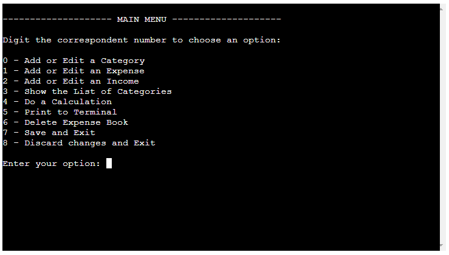

View the repository in GitHub [here](https://github.com/LucaGiarr/expense-book)

View the live project [here](https://expense-book.herokuapp.com/)

---

## CONTENTS

* [User Experience (UX)](#User-Experience-(UX))
  * [User Stories](#User-Stories)
  * [Key information for the app](#Key-information-for-the-app)
* [Features](#Features)
  * [Check Existing Data Screen](#Check-Existing-Data-Screen)
  * [Main Menu](#Main-Menu)
  * [Add or Edit a Category](#Add-or-Edit-a-Category)
  * [Add or Edit an Expense](#Add-or-Edit-an-Expense)
  * [Add or Edit an Income](#Add-or-Edit-an-Income)
  * [Show Categories](#Show-Categories)
  * [Do Calculations](#Do-Calculations)
  * [Print to Terminal](#Print-to-Terminal)
  * [Delete Expense Book](#Delete-Expense-Book)
  * [Data Validation](#Data-Validation)
  * [Future Development](#Future-Development)
* [Data Model Design](#Data-Model-Design)
* [Libraries and Technology Used](#Libraries-and-Technology-Used)
  * [Python Libraries and Packages](#Python-Libraries-and-Packages)
  * [Programs Used](#Programs-Used)
* [Testing](#Testing)
  * [Validator Testing](#Validator-Testing)
  * [Manual Testing](#Manual-Testing)
  * [Known Bugs](#Known-Bugs)
* [Validator Testing](#Validator-Testing)
* [Deployment](#Deployment)
* [Credits](#Credits)
  * [Code Used](#Code-Used)
  * [Acknowledgments](#Acknowledgments)

---

## User Experience (UX)

### User Stories

The Expense Book is an app that aims to help the user to manage his/her finances keeping track of the daily expenses and income in the year 2023.

As a User I want to:

* navigate the app
* know if my input is correct or not
* input an expense
* input an income
* do some calculations with expenses and incomes
* print to terminal my expense and incomes
* save my expenses and incomes
* discard the changes I made

### Key information for the app

* Terminal based user interface.
* Input & print to terminal expenses and incomes.

---

## Features

Below are shown the main features present in the app.

### Check Existing Data Screen

In the first instance, the app will check in the database (Google Sheet spreadsheet) if any existing data is present.
If no data is present the user will be asked to add max 10 categories hence creating an expense Book.

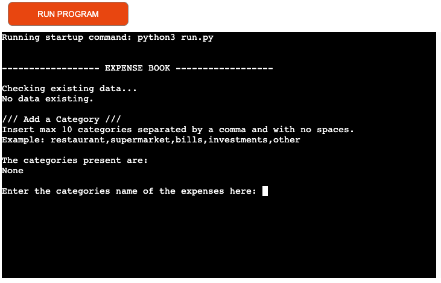

If data is present, the user will be prompted to the window in the image below.

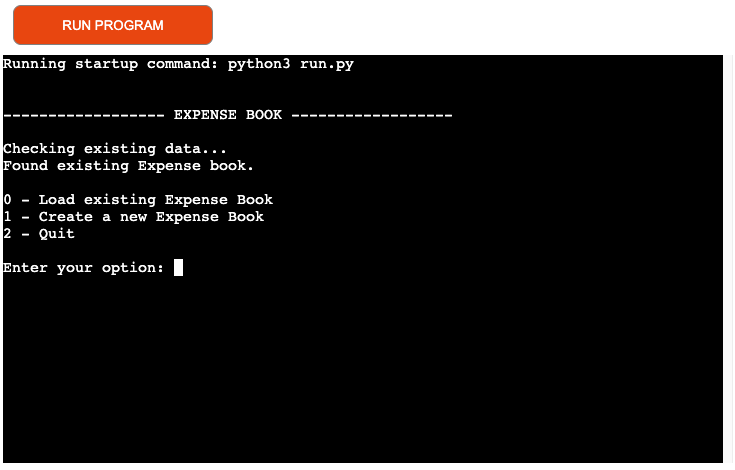

### Main Menu

The main menu is the core of the app from where the user can add edit or remove categories of expenses, incomes, do some calculations, print the expense categories, expenses and incomes and exit saving or without saving the changes made.

### Add or Edit a Category

The user can add, rename or delete an expense category.

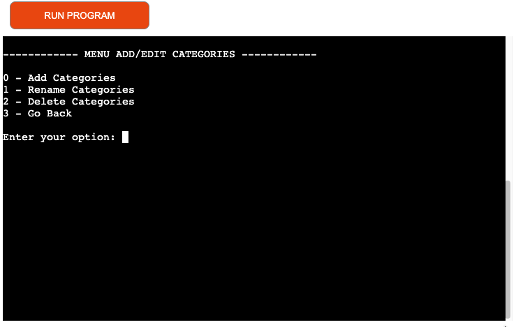

### Add or Edit an Expense

The user can add, rename or delete an expense.

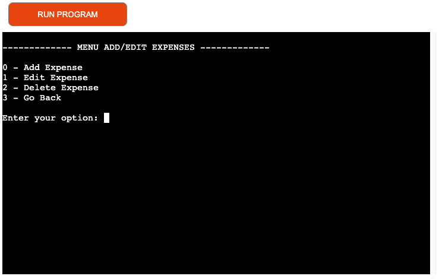

### Add or Edit an Income

The user can add, rename or delete an income.

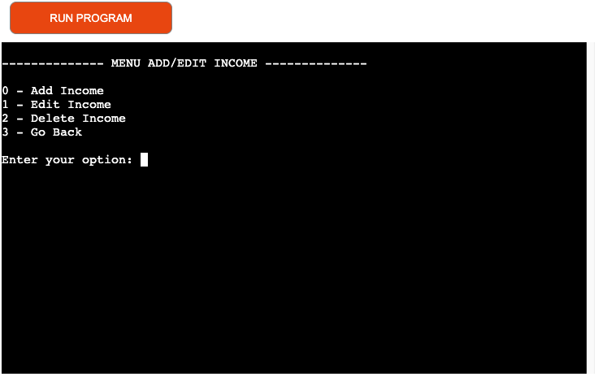

### Show Categories

The user can see what are the categories present.

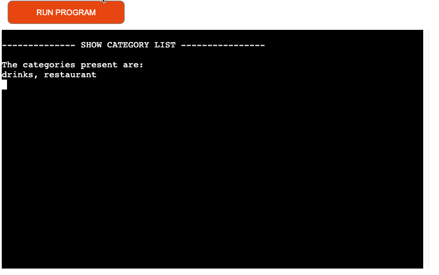

### Do Calculations

The user can do calculations to know how much was spent in a period of time chosen by him/her.

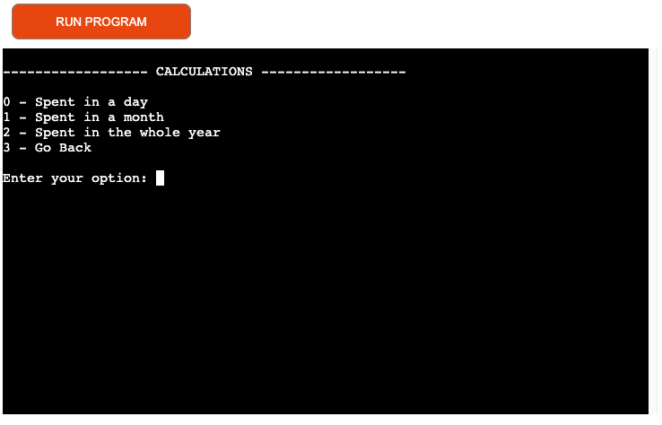

### Print to Terminal

The user can see the details of the expenses or incomes in a period of time chosen by him/her.

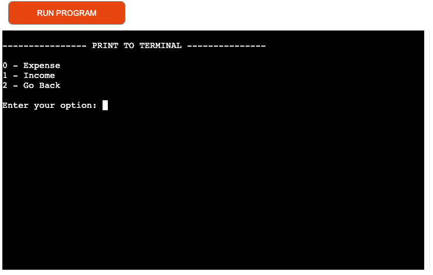

### Delete Expense Book

The user can decide to delete the whole expense book (expenses, incomes and categories) or choose to delete expense or incomes of a period of time chosen by him/her.

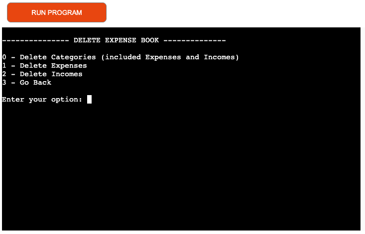

### Data Validation

The data inserted by the user is validated at every time.
The validation regards the menu choice, the name of the categories, the expenses and incomes and the date.
If the user inputs anything else than the required options an error message is displayed letting the user know that this is the wrong input.

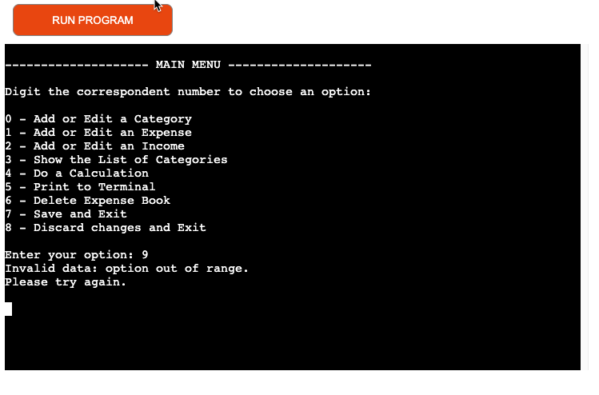

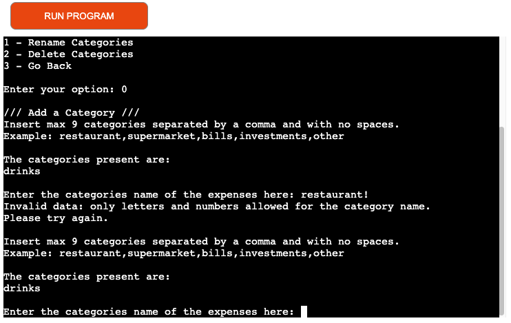

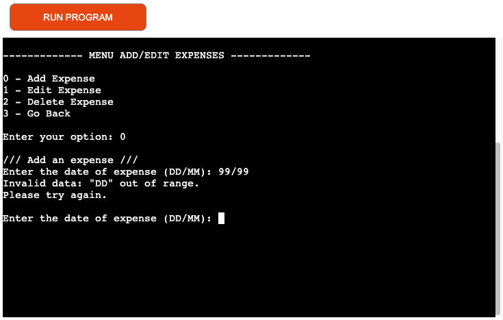

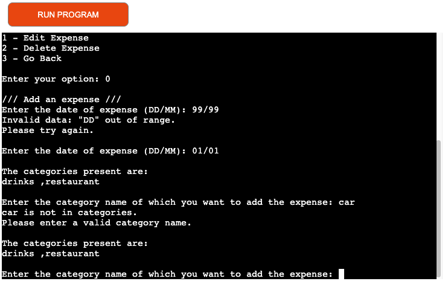

### Future Development

* Create an app with a more user-friendly interface using html and css

---

## Data Model Design

A flow chart diagram was created to visualize the various features and to control the flow statements of the app.
The diagram was drafted to capture the app's functionality and relationships with the user.
Once the user starts the app, it controls if any existing data (expenses and/or incomes) are saved.
If so, it lets the user decide to load the existing data or create a new Expense Book , deleting the old data.
Then, the user is presented with the main menu from which he/she can access all the functionality of the app.

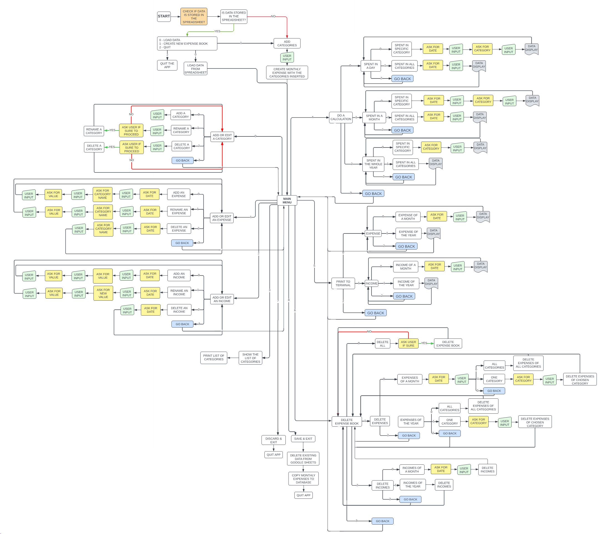

---

## Libraries and Technology Used

### Python Libraries and Packages

* pip - Used to install python libraries via the terminal
* pandas - Used to create dataframes to manipulate data
* time - Used to create the  sleep function
* os - Used to create the function to clear the terminal
* collections - (Counter) used in the validation of the category name
* gspread - Used to load the data from a spreadsheet in google sheets
* google.oauth2.service_account

### Programs Used

* Git - For version control
* GitHub - To save and store the files for the website
* Pycharm - Used as python IDE
* LucidCharts - Used to create the Flowchart.

---

## Testing

The app was tested continuously during the coding process with print() methods to make sure the correct functionality and features worked as expected.
Errors or warnings were fixed as they appeared, such as indentation errors, lines too long or extra space issues.
Testing inputs were used to ensure user inputs would be handled correctly and feedback was given to the user.
Tests were carried out using a MacBook pro 2017 using the browsers Chrome, Safari and Mozilla Firefox.
Tests were also carried out on mobile with the app working without errors on android.
On IPhone the app loads but the user cannot interact with it because the os does not allow he/she to input any character or number from the keyboard.

### Validator Testing

[pep8 online (Code Institute)](https://pep8ci.herokuapp.com/) was used to validate the code. The file run.py was checked with no errors reported.

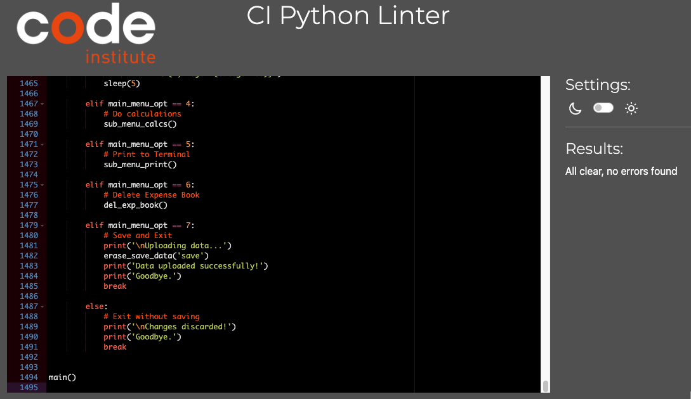

### Manual Testing

The following tests were carried out to ensure the app would work as expected.

* Checking Existing Data - the app checks if there is any category in the spreadsheet saved in Google Sheets. If no categories are read it asks the user to add up to 10 expense categories. If any category name is read, the user is directed to a menu where he/she can choose to load the date from the spreadsheet or create a new Expense Book.
* Load Existing Expense Book - It loads the data from the spreadsheet in Google Sheets and creates a list with the categories and a dataframe with all existing expenses per each category and all incomes per each month as expected.
* Main menu - Each number shown directs the user to a different feature. If the input is not shown a message is displayed to the terminal letting the user know that the number is out of range.
* All features and all sub-menus of each feature - All functionalities of all menus and sub-menus were tested including tests on:
  validation of menu options, validation of category names, validation of date, checks if the category name entered by the user was present or not if required, adding/reaming and deleting a category, adding/editing and deleting an expense or an income and all worked as expected.
* Show Categories - It shows the category present.
* Do calculations - All functionalities of all menus and sub-menus were tested including and not restricted to tests on:
  validation of menu options, validation of category names, validation of date, checks if the category name entered by the user was present or not if required, expense values were correct or not and all worked as expected.
* Print to Terminal - All functionalities of all menus and sub-menus were tested including and not restricted to tests on:
  validation of menu options, validation of category names, validation of date, checks if the category name entered by the user was present or not if required, expense and income values were correct or not and that they are shown in the terminal with a table format together with the days or months numbers. All worked as expected.
* Delete Expense Book - All functionalities of all menus and sub-menus were tested including and not restricted to tests on:
  validation of menu options, validation of category names, validation of date, checks if the category name entered by the user was present or not if required, deleting the entire Expense book, deleting expenses of just a category or all categories in a specified month of the whole year, delete incomes of a specified month or of the whole year. All worked as expected.
* Save and Exit - Data and any change is saved in the spreadsheet in Google Sheets which is cleared just before the new data is copied and saved. All worked as expected.
* Discard and Exit - Exit without saving the changes made by the user. It works as expected.

### Known Bugs

When tests were carried out on mobile, on IPhone the app was loading the first page with no errors, it was printing the info regarding the data found (or not found) but the user could not interact with it because the browser did not allow he/she to input any character or number from the keyboard.
The app was tested in multiple browsers such as Safari, Chrome and Firefox obtaining the same result.

---

## Deployment

The site was deployed via Heroku, and the live link can be found here: Finance App

This project was developed utilizing the Code Institute Template. Some deployment steps below are specifically required for the new CI template and may not be applicable to older versions, or different projects.

Before deploying to Heroku pip3 freeze > requirements.txt was used to install dependencies.

1. Log in to Heroku or create an account if required.
2. Click the button labeled New from the dashboard in the top right corner and from the drop-down menu select Create New App.
3. You must enter a unique app name, (I used expense-book).
4. Next, select your region, (I chose Europe as I am in Ireland).
5. Click on the Create App button.
6. The next page you will see is the project’s Deploy Tab. Click on the Settings Tab and scroll down to Config Vars.
7. Click Reveal Config Vars and enter port into the Key box and 8000 into the Value box and click the Add button.
8. Next, scroll down to the Buildpack section click Add Buildpack select python and click Save Changes.
9. Repeat step 8 to add node.js. o Note: The Buildpacks must be in the correct order. If not click and drag them to move into the correct order.
10. Scroll to the top of the page and now choose the Deploy tab.
11. Select GitHub as the deployment method.
12. Confirm you want to connect to GitHub.
13. Search for the repository name and click the connect button.
14. Scroll to the bottom of the deploy page and select Preferred deployment type:
    Click either Enable Automatic Deploys for automatic deployment when you push updates to GitHub.
    Select the correct branch for deployment from the drop-down menu and click Deploy Branch for manual deployment.

---

## Credits

Some of the website I visited during the development of the app were:

[https://pandas.pydata.org/docs/getting_started/index.html](https://pandas.pydata.org/docs/getting_started/index.html)
[https://pandas.pydata.org/docs/reference/api/pandas.DataFrame.html](https://pandas.pydata.org/docs/reference/api/pandas.DataFrame.html)

### Code Used

[https://www.geeksforgeeks.org/clear-screen-python/](https://www.geeksforgeeks.org/clear-screen-python/)
[Function that returns the number of days in a given month](https://www.tutorialspoint.com/number-of-days-in-a-month-in-python#:~:text=Practical%20Data%20Science%20using%20Python&text=Suppose%20we%20have%20one%20year,then%20the%20result%20is%2029.&text=if%20m%20is%20in%20the,31%2C%20otherwise%2C%20return%2030)

### Acknowledgments

I would like to acknowledge the following people who helped me along the way in completing my third milestone project:

Antonio Rodriguez, my Code Institute Mentor that was very helpful, who gave me suggestions and tips on how to approach this project and, in the end, on the overall look of the app.
Code Institute, for the lessons (especially the videos related to the love Sandwich project) that were very useful and needful to complete this milestone project.
EzioBav for suggested me to use Pycharm as a python IDE.
